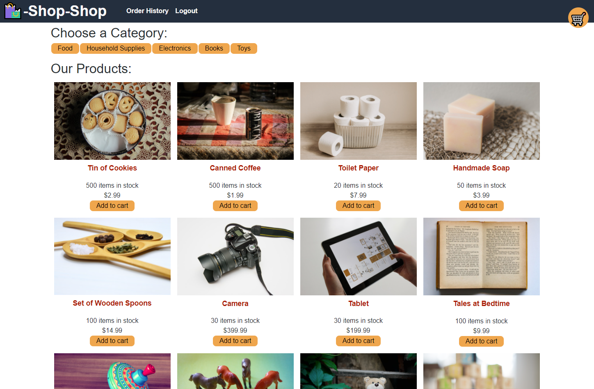

# Shop-Shop

## Description

A MERN stack e-commerce shop built with Stripe functionality. Refactored to utilize Redux from an app built originally from React's Context API.

View the deployed site [here](https://kenny-shop-shop.herokuapp.com/)

## Contents

* [Usage](#usage)
* [Built With](#built-with)
* [Questions](#questions)

## Usage

An online e-commerce site with a variety of items that could be sold online. As a user, I can log in, save items to a cart, and checkout using Stripe. Deployed with Heroku.

## Built With

* Redux
* Apollo
* Node.js
* JavaScript
* GraphQL
* React
* Stripe

## Questions

Created by: [Kenny Larson](https://github.com/kenneththelarson)

For further question please contact [kenneththelarson@gmail.com](mailto:kenneththelarson@gmail.com)